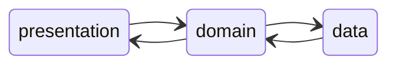
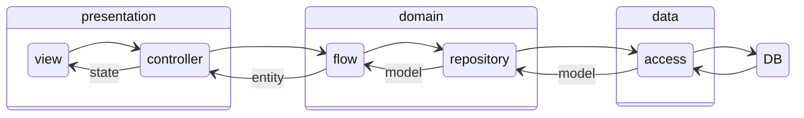

---
tags:
- clean
- architecture
categories: architecture
title: clean architecture
date: 2025-01-18
lastMod: 2025-01-18
---

계층을 만들어서 호출 관계를 정한다.

presentation ➡️ domain ➡️ data

presentation 계층은, controller, state, view 로 나눈다.

domain 계층은, entity, flow, repository 로 나눈다.

data 계층은, access, model 로 나눈다.

(몇 가지 용어는 파일명을 구분하기 위해 변경해서 사용함)

간단한 흐름은 다음과 같다.

## Refs

https://k-elon.tistory.com/38

mason/clean architecture

